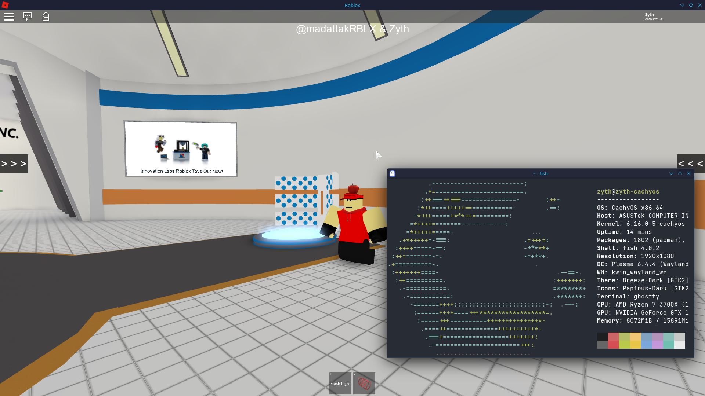

# Pekora Player Bootstrapper for Linux

This is an **unofficial** bootstrapper for Pekora on Linux.

Tested on:
- CachyOS
- Ubuntu 20.04
- Ubuntu 22.04
- Rocky Linux 10
- PopOS 22.04
- Garuda Linux

Bootstrapper is built with glibc 2.17, so as long as your operating system supports that version, it should run the bootstrapper.

However, in testing (for example, Ubuntu 18.04), the clients themselves would not launch. If the clients don't launch, there is nothing I can do about that. You're on your own.

Prerequisites:
- Wine
- Winetricks

Uses Wine and DXVK to provide a performant experience on 2017, 2018, 2020, and 2021 clients.\
Written in Rust.

## Gallery
2017 Pekora on CachyOS

2018 Pekora on CachyOS

2020 Pekora on CachyOS

2021 Pekora on CachyOS


## Usage
To install it, simply run it in your terminal, like so: ./PekoraPlayerBootstraapper\
It might be necessary to give it permission to run, using chmod +x [file]

To launch a game, simply go onto the website and click the Play button. 2017 games will NOT work.

To uninstall, run the bootstrapper with the ``-u`` argument. A desktop shortcut should've also been made called "Uninstall Pekora Player", if you'd prefer that.

### Install locations:
- ~/.local/share/Pekora
- ~/.wine-pekora
- ~/.local/share/applications/pekora-player.desktop
- ~/.local/share/applications/uninstall-pekora-player.desktop

## Configuration
An optional configuration can be made to change the behaviour of the bootstrapper, such as changing how Wine operates, getting debug lines, and showing DXVK's HUD.\
In certain situations where the default Wine operation may not work, the other Wine modes can be tried.\
For example, some virtual machines require DXVK to be installed through the bootstrapper, whilst others require no DXVK to be present.

To set these configuration options, create a new file called ``config.toml`` where the bootstrapper is located (e.g. ~/.local/share/Pekora/versions/{current_version} for bootstrappers that are installed). Then, add whatever configurations you want to the file (not all have to be present). Once saved, the bootstrapper should load these configurations and change behaviours as defined.

```toml
# Configuration file for Pekora Bootstrapper Linux

# Whether to print debug lines, does not change behaviour of the bootstrapper
debug = false

# What mode should Wine operate in?
# 0 = Default, create a Wine prefix for Pekora (.wine-pekora), and install DXVK through Winetricks
# 1 = Create a Wine prefix for Pekora (.wine-pekora), and install DXVK manually through the bootstrapper
# 2 = Create a Wine prefix for Pekora (.wine-pekora), but do not install DXVK
# 3 = Use the default Wine prefix
# Default is recommended when not having any issues launching Pekora.
#   If you do have issues with Wine, try each option in order.
# When this is changed, it is recommended to clear the .wine-pekora folder in your Home folder.
wine_mode = 0

# Whether to show DXVK's HUD or not. Does not have any effect if DXVK is not installed.
# Also for some reason only works when wine_mode is 0.
# DXVK HUD shows GPU info and FPS.
show_dxvk_hud = false
```

## Creating an Issue
Issues should be formatted as such, otherwise they may be closed:

```
Bootstrapper Version: 0.2.3
Operating System: CachyOS
Wine Version: 10.13
Pekora Client Version: 2017L
Issue: Pekora will not launch
Steps to Reproduce: asdjasfigklwegnelasdjkgn;asd:3
```

## Credits
Credit to @PrintedScript for the startup text code, taken from Syntax bootstrapper.

## Copyright
Copyright (c) 2025 Zyythy. All rights reserved.

You may redistribute this application in its original, unaltered form. 
Any other use, including modification, adaptation, reverse engineering, or incorporation into other projects, is strictly prohibited without written permission.

DISCLAIMER: This application is provided "as-is." The author is not liable for any direct, indirect, incidental, or consequential damages arising from its use, including but not limited to data loss or system failures.

*This bootstrapper in no way uses, redistributes, or modifies proprietary code, trademarks, or assets owned by Roblox Corporation. This bootstrapper is not affiliated with, endorsed by, or sponsored by Roblox Corporation. All code and assets in this application are original works written by me, unless disclosed above.*
